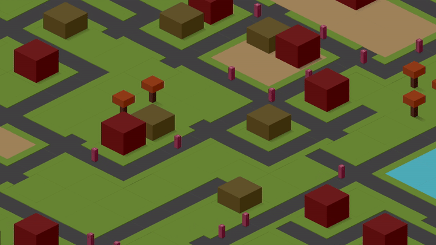

# isometric-game

The purpose of the code in this repository is to demonstrate implementations for
some of the logic necessary to create a 2.5D (isometric) game world.

Much of the logic is an elaboration on the patterns introduced in the 
[2D Game Engine with C++](https://pikuma.com/courses/cpp-2d-game-engine-development) 
course on [Pikuma.com](pikuma.com).

My objective was to become proficient in C++ development to the extent that I could 
develop the foundations of a 2D game.

## Overview



The implementation comprises:
 - Isometric projection of 2D to 2.5D coordinates, per [this video](https://youtu.be/04oQ2jOUjkU?si=yIhHjz9SubxI9CQB) by Jordan West
 - A spatial partition, informed by the [Game Programming Patterns](https://gameprogrammingpatterns.com/spatial-partition.html) book by Robert Nystrom
 - A pathfinding algorithm, informed by a [Red Blob Games](https://www.redblobgames.com/pathfinding/a-star/introduction.html) article on the subject

Additional logic includes:
 - Game loop fundamentals, including timestep and sprite ordering
 - Game data serialisation, supported by the chosen ECS library (EnTT)

### Design Choices

 - **Entity, Component, System**: an ECS framework (EnTT) was used to improve 
 cache utilisation in "hot" (frequently executed) portions of the code; this is
 a common approach in game development
 - **Spatial Partition**: World space is chunked into a spatial partition, limiting 
 per-frame processing to visible chunks

### Current Status

I'm no longer actively working on this project; I was treating it as a learning 
exercise, and (for now), I want to work on improving my skills via other means / 
methods.

The application still suffers from a few issues:
 - The debug screen provides some information about the mouse position - including
 world space, grid, and spatial partition coordinates; in some instances, it is possible
 to crash the application in case the mouse position does not make sense in one of
 those domains (e.g. if the mouse is temporarily off the edge of the screen with 
 a dual-monitor set-up)
 - The spatial partition logic reduces the total number of game entities into
 a list of visible entities to be rendered per frame; that logic appears to suffer
 with issues when elements are at or on spatial partition chunk boundaries,
 and some popping of entities (particularly tiles) is visible when navigating
 around the game world

## Getting Started

The game can be build using CMake, by issuing the following commands from the
root of the repository (Linux, Mac):

```bash
mkdir build/ && cd build
cmake ..
cmake --build .
```

Running the game from the root directory of the repo:

```bash
./IsometricGame
```

The game starts with the camera oriented in the top-left of the game world.

You can use the mouse to pan around the world by moving the cursor toward the
edge of the screen.

Pressing `d` brings up the Debug UI, which enables you to select tiles on the map
and emplace tiles on the screen.

Placing a pair of tall and short buildings will spawn a walker which, in case
a viable path can be found, will navigate between the two.

## Technologies/Libraries

 - [EnTT](https://github.com/skypjack/entt) - the entity, component, system framework
 - [ImGUI](https://github.com/ocornut/imgui) - debug user interface
 - [GLM](https://github.com/g-truc/glm) - mathematics
 - [nlohmann::json](https://github.com/nlohmann/json) - game data


